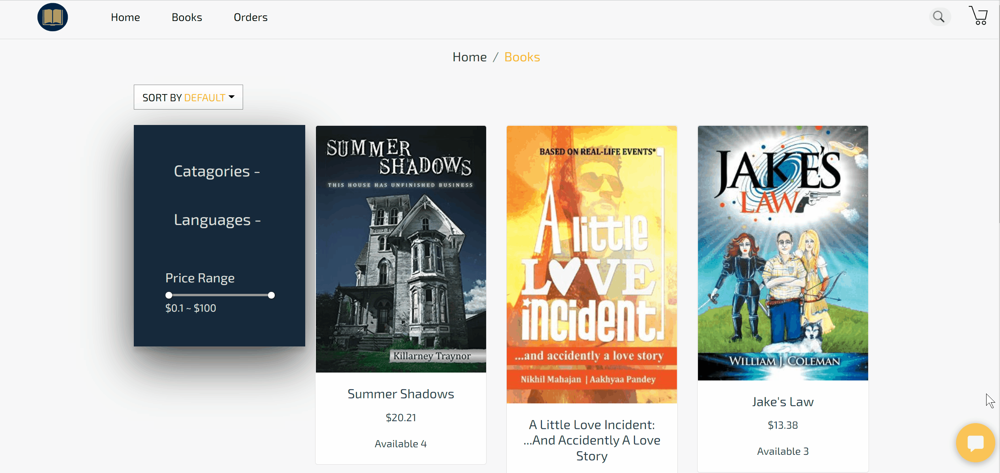
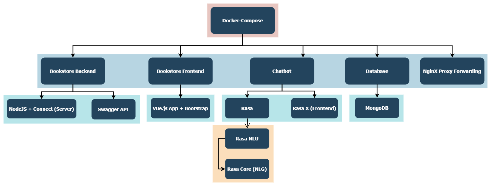
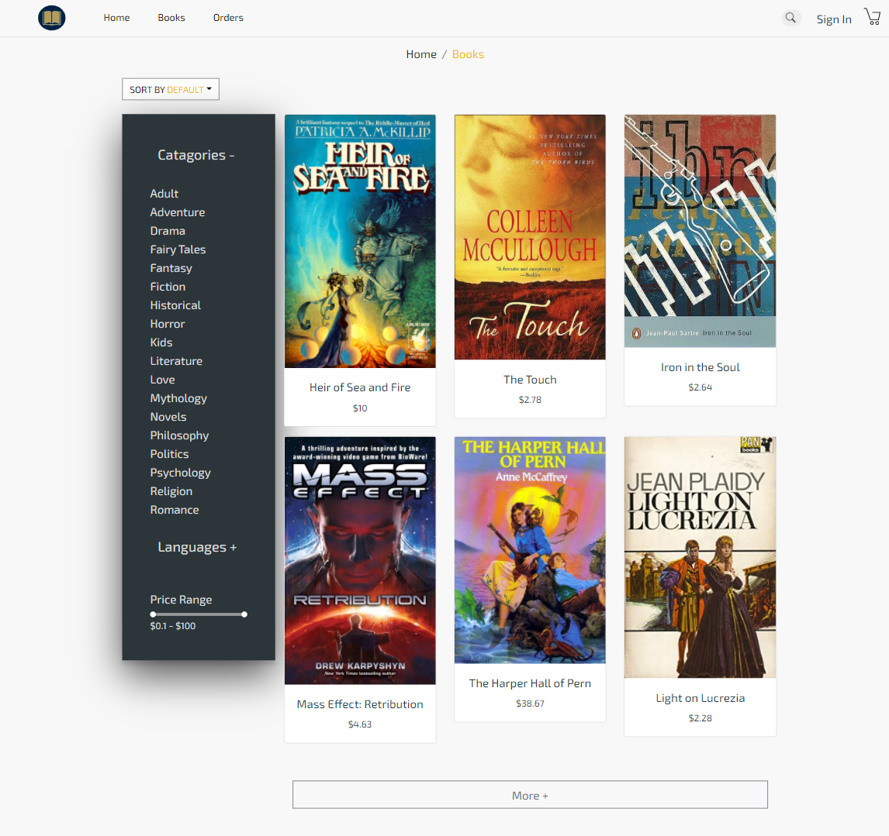

**E-Bookstore**

This is a simple e-bookstore with a chatbot that provides multiple services.

## Demo

Ordering a book through the chatbot.


Reviewing order history.


This project uses the following technologies:

1. Vue.js (bookstore frontend)
2. Node.js (backend)
3. Connection (lighter version of Express for backend-frontend-communication and API endpoint publishing)
4. swagger-ui (API docs)
5. MongoDB (Database => Persistent storage)
6. docker-compose (containerizing services)
7. Rasa (chatbot framework)
8. Rasa NLU (NLU engine fine-tuned for e-bookstore)
9. SpaCy (Language model fine-tuned for e-bookstore)
10. Prodigy (Data annotation tool)

**Important plugins**

- Chatbot widget
    https://www.npmjs.com/package/rasa-webchat


Project structure




## simply clone project and run
```
git clone https://github.com/amrohendawi/Bookstore-chatbot.git

docker-compose up
```

The bookstore frontend at http://localhost:8080




The API docs at http://localhost:8000/docs


NginX proxy-forwards traffic from port 8001 to 8000
