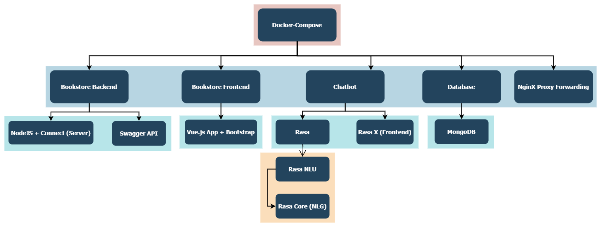
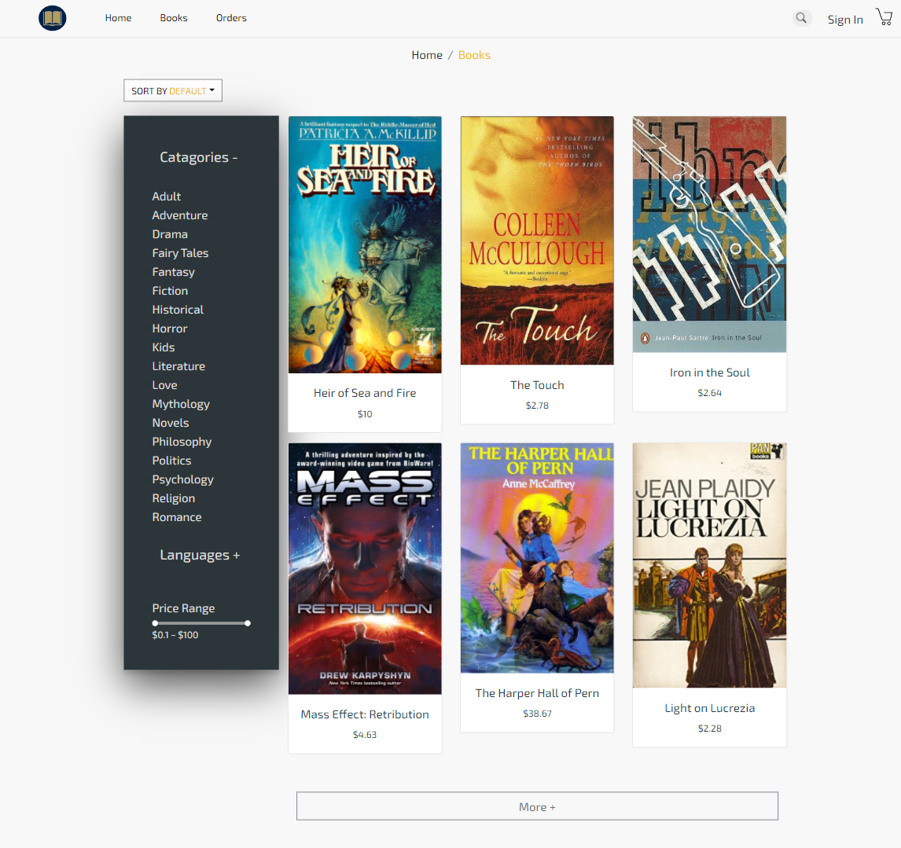
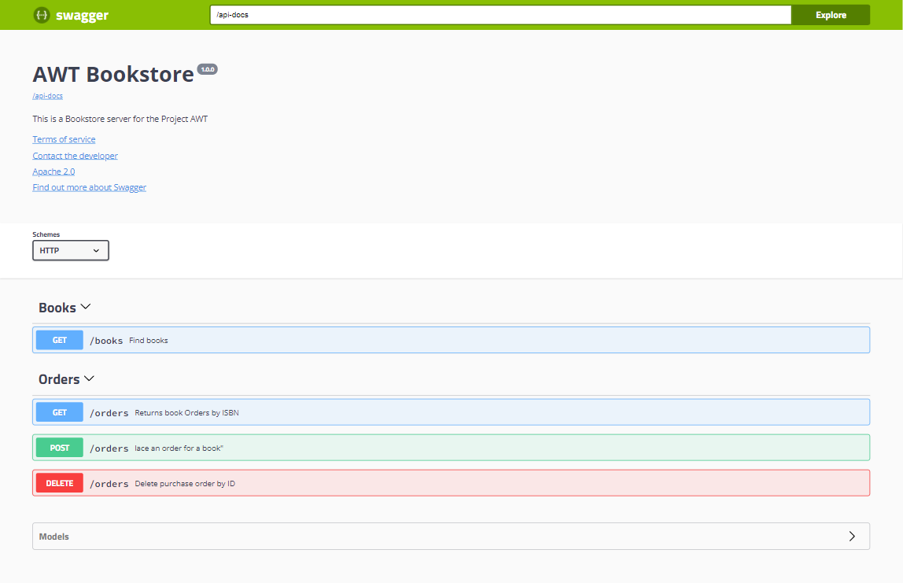

**E-Bookstore**

This project uses the following technologies:

1. Vue.js (bookstore frontend)
2. Node.js (backend)
3. Connection (lighter version of Express for backend-frontend-communication and API endpoint publishing)
4. swagger-ui (API docs)
5. MongoDB (Database => Persistent storage)
6. docker-compose (containerizing services)

**Important plugins**

- Chatbot widget
    https://www.npmjs.com/package/rasa-webchat


Project structure




## simply clone project and run
```
git clone https://git.tu-berlin.de/amro.hendawi/awt-pj-ws21-22-chatbot-semantics-2.git

docker-compose up
```

The bookstore frontend at http://localhost:8080




The API docs at http://localhost:8000/docs




NginX proxy-forwards traffic from port 8001 to 8000
